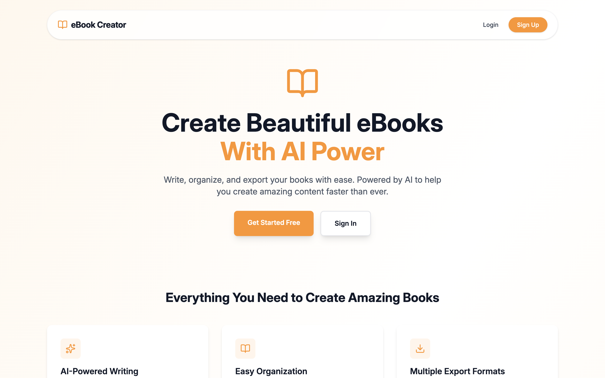
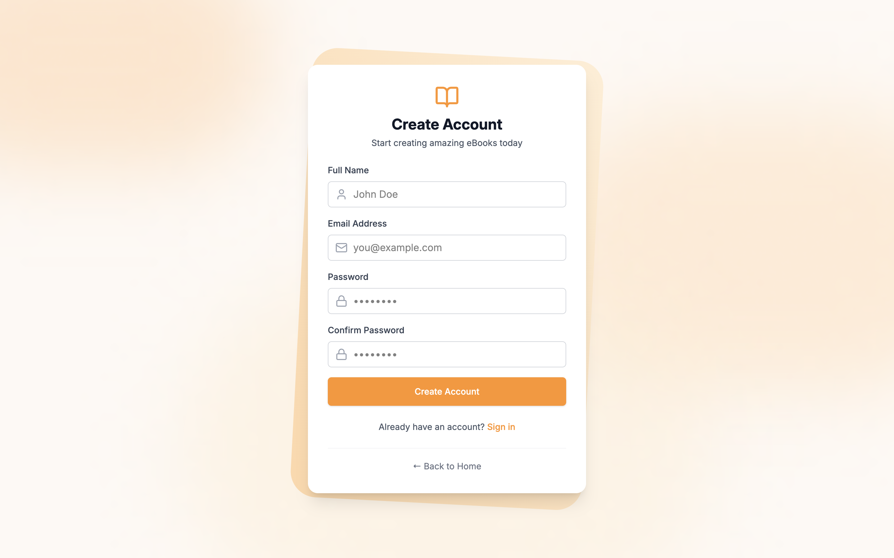
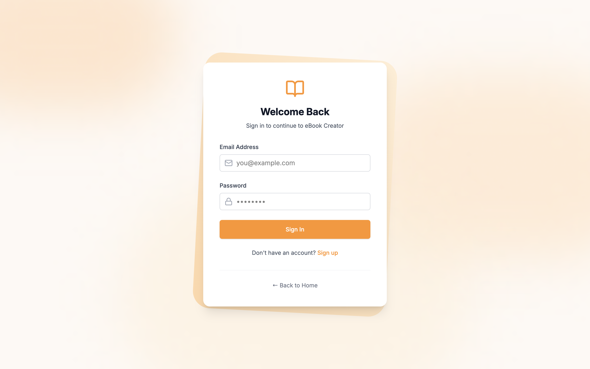
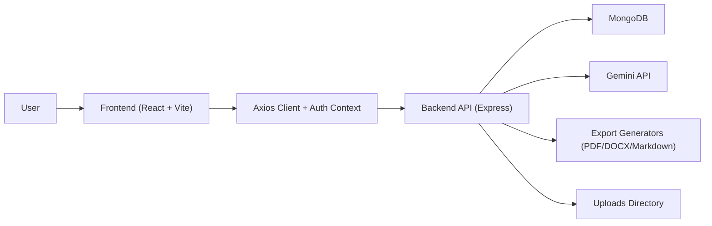

# eBook Creator

An AI-assisted full-stack eBook platform for writing, organizing, publishing, reading, and exporting books. The project is split into three workspaces:

- `frontend/` for the React + Vite web app
- `backend/` for the Express + MongoDB API
- `tests/` for Playwright end-to-end coverage

## Chapterwise Index

1. [Chapter 1. Project Snapshot](#chapter-1-project-snapshot)
2. [Chapter 2. Product Journey](#chapter-2-product-journey)
3. [Chapter 3. Core Features](#chapter-3-core-features)
4. [Chapter 4. Tech Stack](#chapter-4-tech-stack)
5. [Chapter 5. System Architecture](#chapter-5-system-architecture)
6. [Chapter 6. Folder Structure](#chapter-6-folder-structure)
7. [Chapter 7. Local Setup and Run Guide](#chapter-7-local-setup-and-run-guide)
8. [Chapter 8. Environment Variables](#chapter-8-environment-variables)
9. [Chapter 9. API Overview](#chapter-9-api-overview)
10. [Chapter 10. Testing Strategy](#chapter-10-testing-strategy)
11. [Chapter 11. Data Model](#chapter-11-data-model)
12. [Chapter 12. Migration Details](#chapter-12-migration-details)
13. [Chapter 13. Screenshot Placeholder Map](#chapter-13-screenshot-placeholder-map)

## Chapter 1. Project Snapshot

eBook Creator helps a user move from idea to publishable digital book inside one app. It combines authentication, a personal dashboard, a chapter-based editor, AI writing assistance, public publishing, profile management, cover uploads, and export flows for PDF, DOCX, and Markdown.

### What the current product supports

- Public landing page with published book discovery
- User signup, login, logout, and protected routes
- Dashboard for creating, listing, and deleting personal books
- Chapter-based editing with Markdown content
- AI-assisted chapter generation and content improvement
- Book cover upload support via `/uploads`
- Draft or published status management
- Reader view for navigating chapter-by-chapter content
- Profile editing for name, avatar, and password
- Export to PDF, DOCX, and Markdown

## Chapter 2. Product Journey

### 2.1 Landing page and public catalog

The landing page introduces the platform, highlights major capabilities, and shows published books pulled from the public books endpoint. This is the public entry point for unauthenticated visitors.

```md

```

### 2.2 Signup and login

Users can register, log in, and then access protected routes through JWT-based authentication. The frontend stores the token and user in `localStorage`, while `axiosInstance` injects the `Authorization` header automatically.

#### Signup


#### Login


### 2.3 Dashboard

The dashboard is the writer's home screen. It loads the authenticated user's books, supports creating a new book from a modal, and lets the user delete an existing book.

**Suggested screenshot placeholder**

Path: `docs/screenshots/chapter-02-dashboard.png`  
Markdown:

```md

```

### 2.4 Editor

The editor is the core authoring experience. A user can:

- add and remove chapters
- edit chapter titles, descriptions, and Markdown content
- save book updates
- upload a cover image
- publish or unpublish a book
- open AI actions for content generation or improvement
- export the book into supported file formats

**Suggested screenshot placeholder**

Path: `docs/screenshots/chapter-02-editor.png`  
Markdown:

```md

```

### 2.5 Reader view

The reader view renders a book with its cover, chapter navigation, chapter list, and Markdown-rendered content. It is useful both as a preview and as an in-app reading experience for the owner.

**Suggested screenshot placeholder**

Path: `docs/screenshots/chapter-02-reader-view.png`  
Markdown:

```md

```

### 2.6 Profile settings

The profile page allows the authenticated user to update their display name, avatar URL, and password while keeping email read-only.

**Suggested screenshot placeholder**

Path: `docs/screenshots/chapter-02-profile.png`  
Markdown:

```md

```

## Chapter 3. Core Features

### 3.1 Authoring workflow

- create a new book with title, subtitle, and author
- manage a chapter list inside a dedicated editor
- write in Markdown using `@uiw/react-md-editor`
- preview chapter content in the reader experience

### 3.2 AI assistance

The backend exposes four AI endpoints:

- `POST /api/ai/generate-chapter`
- `POST /api/ai/improve-content`
- `POST /api/ai/generate-outline`
- `POST /api/ai/generate-title`

The current frontend actively uses:

- chapter generation
- content improvement for grammar, clarity, and expansion

The outline and title endpoints already exist in the backend and can be wired into the UI later.

### 3.3 Publishing and discovery

- books can be stored as `draft` or `published`
- published books appear in the public landing page catalog
- private dashboard routes remain protected behind authentication

### 3.4 Export capabilities

- PDF export using `pdfkit`
- DOCX export using `docx`
- Markdown export using plain text response generation

### 3.5 Media handling

- cover images are uploaded through `multer`
- backend serves static assets from `/uploads`
- frontend resolves backend asset URLs through `toBackendAssetUrl`

## Chapter 4. Tech Stack

| Layer | Stack |
| --- | --- |
| Frontend | React 19, TypeScript, Vite, React Router, Tailwind CSS, Axios, React Hot Toast, UIW Markdown Editor |
| Backend | Node.js, Express 5, TypeScript, Mongoose, JWT, Bcrypt, Multer |
| AI | Google Generative AI SDK |
| Export | PDFKit, `docx`, Markdown |
| Unit/Integration Testing | Jest, Supertest, MongoMemoryServer |
| E2E Testing | Playwright |

## Chapter 5. System Architecture

### 5.1 High-level flow



### 5.2 Runtime responsibilities

#### Frontend

- `frontend/src/main.tsx` bootstraps `BrowserRouter`, `AuthProvider`, and the toast system
- `frontend/src/App.tsx` defines public and protected routes
- `frontend/src/context/AuthContext.tsx` manages session state and profile refresh/update actions
- `frontend/src/utils/axiosInstance.ts` injects JWT headers and clears invalid sessions on `401`

#### Backend

- `backend/src/app.ts` wires middleware, static uploads, and route groups
- `backend/src/server.ts` loads environment config, connects to MongoDB, and starts the HTTP server
- route groups are split into auth, books, AI, and export APIs
- controllers hold business logic for each route group

#### E2E harness

- `backend/src/e2eServer.ts` is a dedicated in-memory API server for deterministic browser tests
- `tests/playwright.config.ts` boots the e2e backend and the frontend dev server together
- `tests/globalSetup.ts` resets state before the browser suite starts

### 5.3 Route map

- `/api/auth` for registration, login, and profile
- `/api/books` for CRUD, publishing, public listing, and cover uploads
- `/api/ai` for AI-assisted writing helpers
- `/api/export` for file generation
- `/uploads` for serving uploaded cover images

## Chapter 6. Folder Structure

```text
ebook/
├── README.md
├── backend/
│   ├── src/
│   │   ├── app.ts
│   │   ├── server.ts
│   │   ├── config/
│   │   ├── controllers/
│   │   ├── middlewares/
│   │   ├── models/
│   │   ├── routes/
│   │   ├── types/
│   │   └── e2eServer.ts
│   └── tests/
│       ├── integration/
│       ├── unit/
│       └── helpers/
├── frontend/
│   ├── src/
│   │   ├── components/
│   │   ├── context/
│   │   ├── pages/
│   │   ├── types/
│   │   └── utils/
│   └── public/
├── tests/
│   ├── e2e/
│   ├── globalSetup.ts
│   └── playwright.config.ts
└── docs/
    └── screenshots/
```

## Chapter 7. Local Setup and Run Guide

### 7.1 Prerequisites

- Node.js 18+
- npm
- MongoDB running locally or a reachable MongoDB connection string
- Gemini API key for real AI generation

### 7.2 Install dependencies

Run these once:

```bash
cd backend && npm install
cd ../frontend && npm install
cd ../tests && npm install
```

### 7.3 Start the backend

```bash
cd backend
npm run dev
```

### 7.4 Start the frontend

```bash
cd frontend
npm run dev
```

### 7.5 Important local port note

The frontend fallback API URL is `http://localhost:8000/api`, while the backend dev server defaults to port `5000` unless `PORT` is set.

Use one of these two approaches:

1. Set backend `PORT=8000`
2. Or set frontend `VITE_API_BASE_URL=http://127.0.0.1:5000/api`

Recommended local alignment:

```env
# backend/.env
PORT=8000
```

```env
# frontend/.env
VITE_API_BASE_URL=http://127.0.0.1:8000/api
```

## Chapter 8. Environment Variables

### 8.1 Backend

Create `backend/.env` with:

```env
MONGO_URI=mongodb://127.0.0.1:27017/ebook-db
JWT_SECRET=replace-with-a-secure-secret
GEMINI_API_KEY=your-gemini-api-key
PORT=8000
```

### 8.2 Frontend

Create `frontend/.env` with:

```env
VITE_API_BASE_URL=http://127.0.0.1:8000/api
```

### 8.3 Test environment behavior

- backend unit/integration tests set fallback `JWT_SECRET` and `GEMINI_API_KEY` automatically in `backend/tests/setup.ts`
- Playwright uses the dedicated e2e backend and injects `VITE_API_BASE_URL=http://127.0.0.1:8000/api`
- the e2e server provides its own fallback values and does not depend on MongoDB

## Chapter 9. API Overview

### 9.1 Auth API

| Method | Route | Access | Purpose |
| --- | --- | --- | --- |
| `POST` | `/api/auth/register` | Public | Register a new user and return a JWT |
| `POST` | `/api/auth/login` | Public | Login and return token plus user payload |
| `GET` | `/api/auth/profile` | Private | Fetch the current user profile |
| `PUT` | `/api/auth/profile` | Private | Update name, avatar, and optionally password |

### 9.2 Book API

| Method | Route | Access | Purpose |
| --- | --- | --- | --- |
| `GET` | `/api/books/public` | Public | List published books for the landing page |
| `POST` | `/api/books` | Private | Create a book |
| `GET` | `/api/books` | Private | List books owned by the authenticated user |
| `GET` | `/api/books/:id` | Private | Fetch one owned book |
| `PUT` | `/api/books/:id` | Private | Update book metadata, chapters, or status |
| `DELETE` | `/api/books/:id` | Private | Delete a book |
| `PUT` | `/api/books/cover/:id` | Private | Upload or replace a cover image |

### 9.3 AI API

| Method | Route | Access | Purpose |
| --- | --- | --- | --- |
| `POST` | `/api/ai/generate-chapter` | Private | Generate chapter content from chapter metadata |
| `POST` | `/api/ai/improve-content` | Private | Improve existing content |
| `POST` | `/api/ai/generate-outline` | Private | Generate a structured book outline |
| `POST` | `/api/ai/generate-title` | Private | Generate possible titles and subtitles |

### 9.4 Export API

| Method | Route | Access | Purpose |
| --- | --- | --- | --- |
| `GET` | `/api/export/pdf/:id` | Private | Download the book as PDF |
| `GET` | `/api/export/docx/:id` | Private | Download the book as DOCX |
| `GET` | `/api/export/markdown/:id` | Private | Download the book as Markdown |

### 9.5 Common request details

Authenticated endpoints expect:

```http
Authorization: Bearer <jwt_token>
```

Example book payload:

```json
{
  "title": "My First Book",
  "subtitle": "A Practical Writing Journey",
  "author": "Jane Doe",
  "status": "draft",
  "chapters": [
    {
      "title": "Chapter 1",
      "description": "Opening context",
      "content": "## Intro\n\nThis is chapter content."
    }
  ]
}
```

Example AI generation payload:

```json
{
  "title": "Chapter 3: The Breakthrough",
  "description": "The turning point in the story",
  "bookContext": "A startup founder's journey from idea to launch"
}
```

Cover upload details:

- route: `PUT /api/books/cover/:id`
- content type: `multipart/form-data`
- form field: `coverImage`

## Chapter 10. Testing Strategy

### 10.1 Backend unit and integration tests

Backend tests live in `backend/tests` and cover:

- auth middleware
- upload middleware
- `User` model behavior
- `Book` model behavior
- auth API integration
- app-level integration such as CORS and static uploads

Key implementation details:

- Jest runs in-band with `ts-jest`
- Supertest exercises Express routes directly
- `mongodb-memory-server` provides an isolated in-memory MongoDB for tests
- Gemini calls are mocked through `backend/tests/helpers/mockGemini.ts`

Commands:

```bash
cd backend
npm test
npm run test:unit
npm run test:integration
npm run test:coverage
```

Coverage thresholds are configured globally in `backend/jest.config.js` at:

- branches: `80`
- functions: `80`
- lines: `80`
- statements: `80`

### 10.2 Playwright end-to-end tests

E2E tests live in `tests/` and validate real browser flows against a dedicated in-memory backend.

Covered areas include:

- auth smoke flows
- public landing page behavior
- dashboard book lifecycle
- editor, AI, upload, and export flows
- reader and profile settings flows

How the suite works:

- starts `backend/src/e2eServer.ts` on `127.0.0.1:8000`
- starts the frontend dev server with `VITE_API_BASE_URL=http://127.0.0.1:8000/api`
- runs a reset step in `tests/globalSetup.ts`
- uses Chromium for full coverage and Firefox/WebKit for smoke coverage

Commands:

```bash
cd tests
npm run test:e2e
npm run test:e2e -- --project=chromium
npm run test:e2e -- --reporter=line
npm run test:e2e -- --list
```

## Chapter 11. Data Model

### 11.1 User

Defined in `backend/src/models/User.ts`.

| Field | Type | Notes |
| --- | --- | --- |
| `name` | `string` | required |
| `email` | `string` | required, unique, lowercase |
| `password` | `string` | required, hashed before save, not selected by default |
| `avatar` | `string` | optional URL-like string |
| `isPro` | `boolean` | defaults to `false` |

### 11.2 Book

Defined in `backend/src/models/Book.ts`.

| Field | Type | Notes |
| --- | --- | --- |
| `userId` | `ObjectId` | owner reference |
| `title` | `string` | required |
| `subtitle` | `string` | optional |
| `author` | `string` | required |
| `coverImage` | `string` | upload path or external URL |
| `chapters` | `Chapter[]` | nested chapter list |
| `status` | `"draft" \| "published"` | defaults to `draft` |
| `createdAt` | `Date` | auto-generated |
| `updatedAt` | `Date` | auto-generated |

### 11.3 Chapter

Nested inside the book schema.

| Field | Type | Notes |
| --- | --- | --- |
| `title` | `string` | required |
| `description` | `string` | optional summary |
| `content` | `string` | Markdown content |

## Chapter 12. Migration Details

### 12.1 Current migration status

This repository has already started a TypeScript hardening migration across key frontend flows. The most visible migrated areas are:

- `frontend/src/context/AuthContext.tsx`
- `frontend/src/pages/EditorPage.tsx`
- `frontend/src/pages/ViewBookPage.tsx`
- shared types in `frontend/src/types` and `backend/src/types`

### 12.2 What changed in the recent TypeScript migration

#### Auth context migration

- `AuthContext` now uses an explicit `AuthContextValue | null` type
- `useAuth` returns a typed context contract
- provider `children` are typed with `ReactNode`
- `user` and `token` state are explicitly typed
- auth methods now expose explicit async return contracts
- error handling uses safer `unknown` casting and nullish coalescing

#### Editor page migration

- route params are typed
- editor state is typed as `Book | null`
- chapter update helpers use typed `Chapter` keys
- export format handling is narrowed to `"pdf" | "docx" | "markdown"`
- AI improvement handling is narrowed to supported action types
- null guards were added before book-dependent operations

#### Reader page migration

- route params are typed
- book state is typed as `Book | null`
- null guards prevent invalid access before the API payload loads

### 12.3 Database migration reality in this repo

There is currently no dedicated migration framework or versioned migration folder in the repository. Schema evolution is code-first through Mongoose models and application updates.

That means a schema change usually requires updates in more than one place:

1. Mongoose schema in `backend/src/models`
2. shared backend types in `backend/src/types/index.ts`
3. frontend types in `frontend/src/types`
4. controllers, validation logic, and route payload handling
5. e2e server contract in `backend/src/e2eServer.ts`
6. backend unit/integration tests and Playwright helpers
7. existing MongoDB documents if a new required field is introduced

### 12.4 Recommended future migration checklist

If you add a new field or change a contract, follow this order:

1. Update the schema and TypeScript types first
2. Update controller logic and request/response payloads
3. Update frontend forms, pages, and API types
4. Update the in-memory e2e server so browser tests stay aligned
5. Update unit, integration, and e2e tests
6. Backfill old data in MongoDB before making a new field mandatory in production

## Chapter 13. Screenshot Placeholder Map

Use the `docs/screenshots/` folder for project images. Suggested filenames:

| Section | Suggested file |
| --- | --- |
| Landing page | `docs/screenshots/chapter-02-landing-page.png` |
| Auth flow | `docs/screenshots/chapter-02-auth-flow.png` |
| Dashboard | `docs/screenshots/chapter-02-dashboard.png` |
| Editor | `docs/screenshots/chapter-02-editor.png` |
| Reader view | `docs/screenshots/chapter-02-reader-view.png` |
| Profile page | `docs/screenshots/chapter-02-profile.png` |
| Architecture diagram screenshot, if needed | `docs/screenshots/chapter-05-architecture.png` |
| Test report screenshot | `docs/screenshots/chapter-10-test-report.png` |

Reusable Markdown snippet:

```md

```

If you want, you can also add screenshots under each chapter using a short caption format like this:

```md
### UI Preview


```
